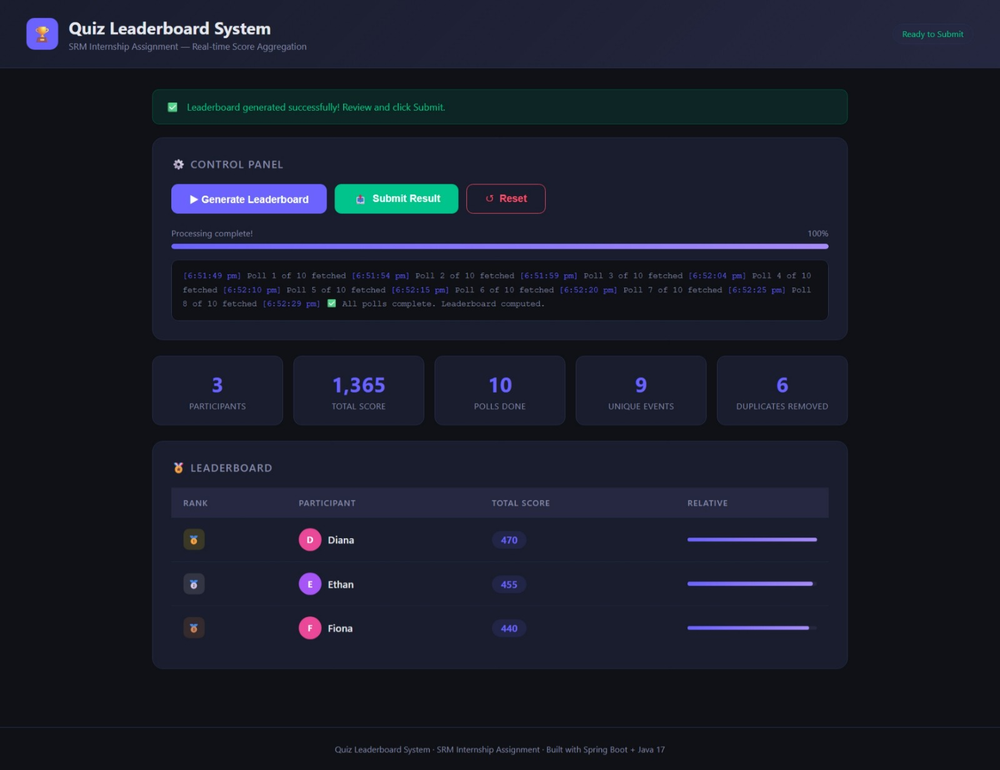

# Quiz Leaderboard System

A Spring Boot backend application that consumes a live quiz API, deduplicates event data across multiple polls, aggregates participant scores, and generates a correct leaderboard — built as part of the **Bajaj Finserv Health × SRM Internship Assignment**.

---

## Challenge Statement

The external validator API simulates a quiz show where participants earn scores across rounds. Due to distributed system behavior, **the same event data may appear in multiple API polls**. The core challenge is to:

- Poll the API exactly **10 times** (poll index 0–9)
- **Deduplicate** events using a composite key (`roundId + participant`)
- **Aggregate** scores correctly per participant
- Generate a **sorted leaderboard**
- **Submit exactly once**

---

## Tech Stack

| Layer | Technology |
|---|---|
| Language | Java 17 |
| Framework | Spring Boot 3.x |
| HTTP Client | RestTemplate |
| Build Tool | Maven |
| Utilities | Lombok |
| Frontend | Vanilla HTML/CSS/JS (served as static resource) |
| Config | Spring `@ConfigurationProperties` |

---

## Project Structure

```
src/main/java/com/srm/quiz/
├── client/
│   └── QuizApiClient.java          # HTTP calls to external API
├── config/
│   ├── AppConfig.java              # RestTemplate bean with timeouts
│   └── QuizApiProperties.java      # Typed config properties
├── controller/
│   ├── QuizController.java         # REST endpoints (/api/*)
│   └── WebController.java          # Serves frontend SPA
├── exception/
│   ├── GlobalExceptionHandler.java # Centralised error handling
│   └── QuizApiException.java       # Custom exception
├── model/dto/
│   ├── ApiResponse.java            # Generic response wrapper
│   ├── LeaderboardEntry.java       # Single leaderboard row
│   ├── LeaderboardResult.java      # Full result with stats
│   ├── PollResponse.java           # External API poll response
│   ├── QuizEvent.java              # Individual quiz event
│   ├── SubmitRequest.java          # Submit payload
│   └── SubmitResponse.java         # Submit API response
├── service/
│   └── QuizService.java            # Core pipeline orchestration
└── util/
    ├── DeduplicationUtil.java      # Duplicate filtering logic
    └── ScoreAggregator.java        # Score aggregation + ranking

src/main/resources/
├── static/
│   └── index.html                  # Frontend UI
└── application.properties          # App configuration
```

---

## Configuration

Edit `src/main/resources/application.properties`:

```properties
quiz.api.base-url=https://devapigw.vidalhealthtpa.com/srm-quiz-task
quiz.api.reg-no=RA2311003030424
quiz.api.total-polls=10
quiz.api.poll-delay-ms=5000
quiz.api.connect-timeout-ms=10000
quiz.api.read-timeout-ms=15000
```

---

## How It Works

### Pipeline (triggered by `POST /api/start`)

```
┌─────────────────────────────────────────────────────────┐
│                     QuizService                         │
│                                                         │
│  for poll 0..9:                                         │
│    1. GET /quiz/messages?regNo=...&poll={i}             │
│    2. Filter duplicates via (roundId + participant) key │
│    3. Accumulate unique events                          │
│    4. Wait 5 seconds (mandatory delay)                  │
│                                                         │
│  After all polls:                                       │
│    5. Aggregate scores per participant                  │
│    6. Sort descending by totalScore                     │
│    7. Assign ranks (ties share same rank)               │
│    8. Cache result                                      │
└─────────────────────────────────────────────────────────┘
```

### Deduplication Logic

Each `QuizEvent` has a deduplication key:
```java
public String deduplicationKey() {
    return roundId + "_" + participant;
}
```

A `HashSet<String>` tracks seen keys across all polls. If the same `(roundId, participant)` pair appears again in a later poll, it is silently discarded — ensuring each score is counted **exactly once**.

### Score Aggregation & Ranking

- Scores are summed per participant using a `Map<String, Integer>`
- Sorted descending by `totalScore` (alphabetical as tiebreaker)
- Ranks are assigned with **tie sharing** (two participants with the same score share the same rank)

---

## REST API Reference

### `POST /api/start`
Triggers the full pipeline: 10 polls + deduplication + aggregation. Takes ~50 seconds.

**Response:**
```json
{
  "success": true,
  "message": "Leaderboard computed successfully. Ready to submit.",
  "data": {
    "leaderboard": [
      { "participant": "Alice", "totalScore": 150, "rank": 1 }
    ],
    "totalScore": 370,
    "totalPolls": 10,
    "totalEventsReceived": 28,
    "totalDuplicatesRemoved": 8,
    "uniqueEventsProcessed": 20,
    "status": "READY"
  }
}
```

### `GET /api/leaderboard`
Returns the cached leaderboard without re-polling.

### `POST /api/submit`
Submits the leaderboard to the external API. Can only be called **once** — duplicate calls are rejected with HTTP 409.

**Response:**
```json
{
  "success": true,
  "message": "✅ Submission accepted! Correct!",
  "data": {
    "isCorrect": true,
    "submittedTotal": 370,
    "expectedTotal": 370,
    "message": "Correct!"
  }
}
```

### `POST /api/reset`
Clears cached state so the pipeline can be re-run from scratch.

---

## Frontend UI

The app ships with a built-in web interface served at `http://localhost:8080`.

Features:
- **Generate Leaderboard** — starts the pipeline with live poll progress log
- **Submit Result** — one-click submission with success/failure feedback
- **Reset** — clears state for a fresh run
- Stats panel showing participants, total score, polls, unique events, and duplicates removed
- Ranked leaderboard table with gold/silver/bronze highlights

---

## Running the Application

### Prerequisites
- Java 17+
- Maven 3.8+

### Steps

```bash
# 1. Clone the repository
git clone https://github.com/your-username/quiz-leaderboard-system.git
cd quiz-leaderboard-system

# 2. Configure your registration number in application.properties
#    quiz.api.reg-no=YOUR_REG_NO

# 3. Build the project
./mvnw clean package -DskipTests

# 4. Run
./mvnw spring-boot:run

# 5. Open in browser
# http://localhost:8080
```

---

## Testing the API Manually

```bash
# Trigger pipeline
curl -X POST http://localhost:8080/api/start

# View leaderboard
curl http://localhost:8080/api/leaderboard

# Submit
curl -X POST http://localhost:8080/api/submit

# Reset
curl -X POST http://localhost:8080/api/reset
```

---

## Error Handling

All errors are returned in a consistent format:

```json
{
  "success": false,
  "message": "External API error: 503 Service Unavailable"
}
```

| Scenario | HTTP Status |
|---|---|
| External API unreachable | 503 Service Unavailable |
| External API returns error | 502 Bad Gateway |
| Submit called before start | 409 Conflict |
| Double submission attempt | 409 Conflict |
| Polling interrupted | 500 Internal Server Error |

---
## Sample Output



